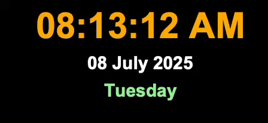

# digital-clock-tkinter
A simple digital clock GUI application built using Python's Tkinter module. It displays the current time (hours, minutes, seconds, AM/PM), the day of the week, and the current date in real-time. The clock updates every second using the after() method and uses the strftime function from the time module.
## 🕒 Demo

